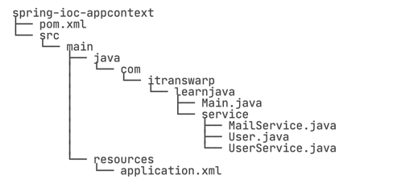
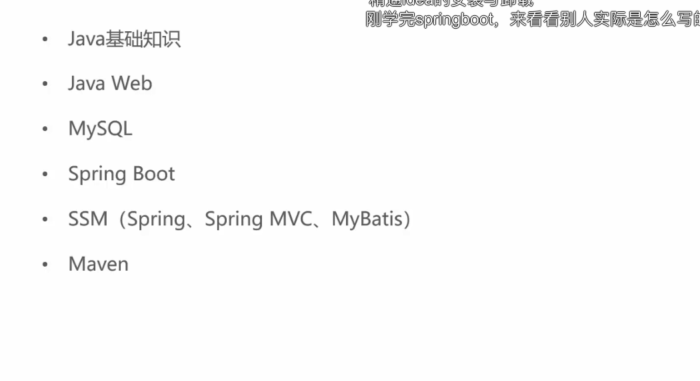
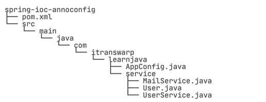
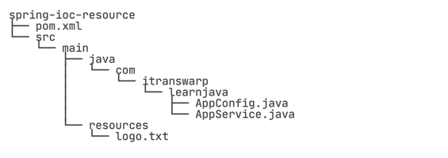

##### IoC(Inversion of Control)解决的核心问题：

- 谁负责创建组件
- 谁负责根据依赖关系组装组件
- 销毁时，如何按照依赖顺序正确销毁

在IoC模式下，控制权发生了反转，即从应用程序转移到了IoC容器，所有组件不再由应用程序自己创建和配置，而是由IoC容器负责，这样，应用程序只需要直接使用已经创建好并且配置好的组件。为了能让组件在IoC容器中被“装配”出来，需要某种“注入”机制，例如，BookService自己并不会创建DataSource，而是等待外部通过setDataSource()
方法来注入一个DataSource
> 将组件的创建+配置与组件的使用相分离，并且，由IoC容器负责管理组件的生命周期

- 无侵入容器：应用程序无需实现Spring的特定接口，或者说，组件根本不知道自己在Spring的容器中运行。
    - 应用程序组件即可以在Spring的IoC容器中运行，也可以自己编写代码自行组装配置
    - 测试的时候并不依赖Spring容器，可单独进行测试，大大提高了开发效率

##### 装配Bean

一个具体的用户登陆注册的例子的工程结构：





- 每个<bean ...>都有一个id便是，相当于Bean的唯一ID
- 在userService Bean中，通过<property name="..." red=..."/>注入了另一个Bean
- Bean的顺序不重要，Spring根据依赖关系会自动正确初始化 把上述的XML配置文件用Java写出来，就想这样：

```java
UserService userService=new UserService();
        MailService mailService=new MailService();
        UserService.setMailService(mailService);
```

<font color="red">只不过Spring容器是通过读取XML文件后使用反射完成的</font>

如果注入的不是Bean，而是boolean、int、String这样的数据类型，则通过value注入，例如，创建一个HikariDataSource


最后，我们需要创建一个Spring的IoC容器实例，然后加在配置文件，让Spring容器为我们创建并装配好配置文件中指定的所有Bean，这只需要一行代码：

```java
ApplicationContext context=new ClassPathXmlApplicationContext("application.xml");
```

接下来，我们就可以从Spring容器中"取出"装配好的Bean然后使用它：

```java
UserService userService=context.getBean(UserService.class);
        User user=userService.login("bob@example.com","password");
```

完整的main：

```java
public class Main {
    public static void main(String[] args) {
        ApplicationContext context = new ClassPathXmlApplicationContext("application.xml");
        UserService user = context.getBean(UserService.class);
        User user = userService.login("bob@example.com", "password");
        System.out.println(user.getName());
    }
}
```

- 我们可以看到Spring的容器就是ApplicationContext，它是一个接口，有很多实现类，这里我们选择ClassPathXmlApplicationContext，表示它会自动从classpath中查找指定的XML配置文件。
- 获得了ApplicationContext的实例，就获得了IoC容器的引用。从ApplicationContext中我们可以根据**Bean的ID**获取Bean，但更多时候我们是根据**Bean的类型**获取Bean的引用：

```java
UserService userService=context.getBean(UserService.class);
```

Spring还提供另一种IoC容器叫BeanFactory，使用方式和ApplicationContext类似：

```java
BeanFactory factory=new XmlBeanFactory(new ClassPathResource("application.xml"));
        MailService mailService=factory.getBean(MailService.class);
```

<font color="pink">
BeanFactory和ApplicationContext的区别在于，BeanFactory的实现是按需创建，即第一次获取Bean时才创建这个Bean，而Application会一次创建所有的Bean。实际上ApplicationContext接口是从BeanFactory接口继承而来的，并且，ApplicationContext提供了一些额外的功能，包括国际化支持、事件和通知机制等。通常情况下，我们总是使用ApplicationContext，很少会使用BeanFactory</font>

##### 使用Annotation装配

比起手写XML文件，还有一种更简单的方法来进行配置，就是使用**Annotation**配置，让Spring自动扫描Bean并组装它们

首先，给MailService添加一个@Component

```java

@Component
public class MailService {
  ...
}
```

这个@Component注解就相当于定义了一个Bean，它有一个可选的名称，默认是mailService，即小写开头的类名 然后，我们给UserService添加一个@Component注解和一个@Autowired注解：

```java

@Component
public class UserService {
    @Autowired
    MailService mailService;
}
```

使用@Autowired就相当于把指定类型的Bean注入到指定的子段中。和XML配置相比，@Autowired大幅简化了注入，不但可以写在set()方法上，甚至可以写在构造方法中
<font color=pink>我们一般把@Autowired写在字段上，通常使用package权限的字段，便于测试</font>

```java
@Configuration
@ComponentScan
class public AppConfig{
        ApplicationContext context=new AnnotationConfigApplicationContext(Appconfig.class);
        UserService userservice=context.getBean(UserService.class);
        User user=userService.login("bob@example.com","password");
        System.out.println(user.getName());

        }
```

除了main()
方法以外，AppConfig标注了@Configuration，表示它是一个配置类，因为我们创建Application时，使用的实现类是AnnotationConfigApplicationContext,必须传入一个标注了@Configuration的类名。
此外，AppConfig还标注了**@ComponentScan**，它告诉同期，自动搜索当前类所在的包以及子包，把所有标注为@Component的Bean自动创建出来，并根据@Autowired进行装配

整个工程结构如下

使用Annotation配合自动扫描能大幅简化Spring的配置，我们只需要保证：

- 每个Bean都被标注为@Component并正确使用@Autowired注入
- 配置类被标为@Configuration和@ComponentScan
- 所有Bean均在指定包及子包内（和配置类在同一个包或子包）

<font color="pink">
使用@ComponentScan非常方便，但是我们也要特别注意包的层次结构。通常来说，启动配置AppConfig位于自定义的顶层包，例如com.iteranswarp.learnjava,其他Bean按类别放入子包</font>

默认情况下，对一种类型的Bean，容器只创建一个实例，但是有些时候我们需要对一种类型的Bean创建多个实例。例如，同时连接多个数据库，就需要多个DataSource实例。<font color=pink>
这个时候就要对Bean进行命名</font>

- 使用@Bean("name")
- 使用@Bean+Qaulifier("name")

```java
import javax.management.MXBean;

@Configure
@ComponentScan
public class AppConfig {
    @Bean("z")
    ZoneId createZoneIdOfZ() {
        return ZoneId.of("z");
    }

    @Bean
    @Qaulifier("utc8")
    ZoneId createZoneIdOfUtc8() {
        return ZoneId.of("utc8");
    }
}
```

在有多个实例的情况下，注入也要加上别名

```java
@Autowired
@Qaulifer("z")
ZoneId zoneId=Zoneid.systemDefault();
```

或者在创建时加上<font color=pink>@Primary</font>,这样在创建时如果没有指定别名，那么创建的就是这个带@Primary的实例

##### 使用FactoryBean

Spring也提供了工厂模式，允许定一个工厂，然后由工厂创建真正的Bean 用工厂模式需要实现FactoryBean接口：

```java

@Component
public class FactoryBeanOfZoneId implements FactoryBean<ZoneId> {
    String zone = 'z';

    @Override
    public ZoneId getObject() throws Exception {
        return ZoneId.of(zone);
    }

    @Override
    public Class<?> getObjectType() {
        return ZoneId.class;
    }
}
```

```java

@Component
public class ZoneIdFactoryBean implements FactoryBean<ZoneId> {

    String zone = "Z";

    @Override
    public ZoneId getObject() throws Exception {
        return ZoneId.of(zone);
    }

    @Override
    public Class<?> getObjectType() {
        return ZoneId.class;
    }
}
```

当一个Bean实现了FactoryBean接口后，Spring会先初始化这个Factory然后通过调用getObject()来创建一个真正的Bean，。getObjectType()
可以指定创建的Bean的类型，因为指定类型不一定与实际类型一致，可以是接口或抽象类。

因此，如果定义了一个FactoryBean，要注意Spring创建的Bean实际上是这个FactoryBean的getObject()方法返回的Bean。为了和普通Bean区分，我们通常都以XxxFactoryBean命名。

##### 使用Resource

在Java程序中，我们经常会读取配置文件、资源文件等。使用Spring容器时，我们也可以把"文件"注入进来，方便程序读取。
例如，AppService需要读取logo.txt这个文件，通常情况下我们需要写很多代码来定位文件，打开InputStream。
Spring提供了一个org.springframework.core.io.Resource，它可以像String、int一样使用@Value注入：

```java

import javax.annotation.PostConstruct;

@Component
public class AppService {
  @Value("classpath:/logo.txt")
  private Resource resource;
  private String logo;

  @PostConstruct
  pubic void init() throws IOException{
      try(var reader = new BufferedReader(new InputStreamReader(resource.getInputStream(),StandardCharsets.UTF_8))){
          this.logo = reader.lines().collect(Collections.joining("\n"));
      }
  }
}
```

注入Resource最常用的方式是通过classpath，即蕾丝classpath:/logo.txt 表示在classpath中搜索logo.txt文件，然后直接调用Resource.getInputStream()就可以获取到输入流，避免了自己搜索文件的代码

也可以直接指定文件的路径，例如：
```java
@Value("file:/path/to/logo.txt")
private Resource resource;
```
工程文件结构如下：


使用Maven的
