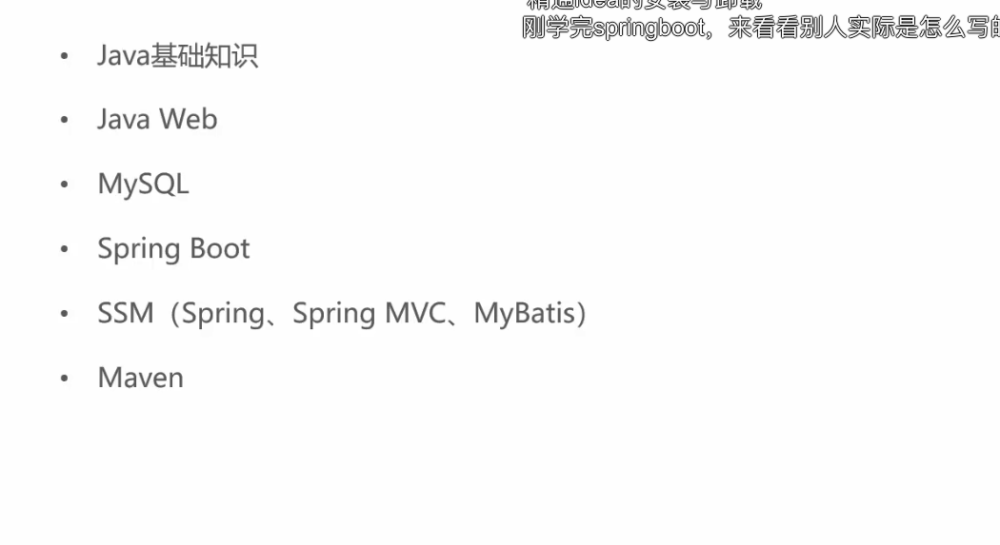

前置知识

# SpringBoot
- 简化Spring的开发 Spring全家桶的一员
- 简化微服务的构建
 提供了一种快速使用Spring的方式，基于约定优于配置的思想，可以让开发人员不必在配置与逻辑业务之间进行思维的切换，全身心的投入到逻辑业务的代码编写中

  ### Spring缺点
- 配置繁琐
- 依赖繁琐
 ### SpringBoot功能
- 自动配置
- 起步依赖：本质是一个Maven项目对象模型，定义了对其他库的传递依赖，这些东西加在一起即支持某项功能
- 辅助功能：提供了一些大型项目中常见的非功能性特性，如嵌入式服务器、安全、指标、健康监测、外部配置等
SpringBoot并不是对Spring功能上的增强，而是提供了一种快速使用Spring的方式

## SpringBoot快速入门
1 创建Maven项目
2 导入SpringBoot起步依赖
3 定义Controller
4 编写引导类
5 启动测试

