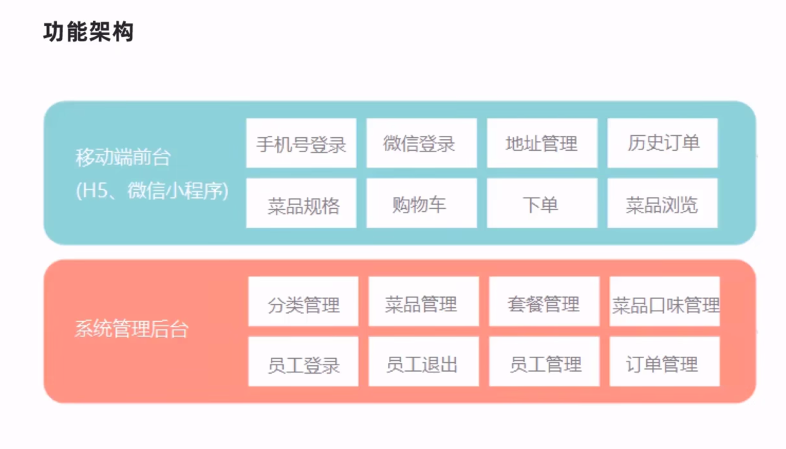
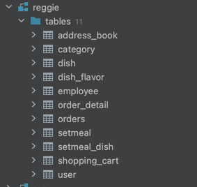

### 开发阶段
2. 基本需求
3. 移动端进行改进
4. 针对系统进行优化升级，提高系统访问性

 #### 数据库设计
一共涉及十一张表：

登陆界面：

退出功能：

##### 代码开发
后台登录功能：
1）创建实体类Employee和emplo yee表进行映射，可以直接导入资料中提供的实体类
登陆处理逻辑：
1. 将页面的密码password进行md5加密处理
2. 根据页面提交的用户名username查询数据库
3. 如果没有查询到则返回登陆失败结果
4. 查看员工状态，如果为已禁用状态，则返回员工已禁用结果
5. 登陆成功，将员工id存入Session并返回登陆成功结果

后台登出功能：
1. 获取Session并清除employee id
2. 返回退出成功结果

员工管理：

### 遇到的问题
- springboot要和jdk的版本号对应 jdk1.8对应的是springboot 2.7.8 