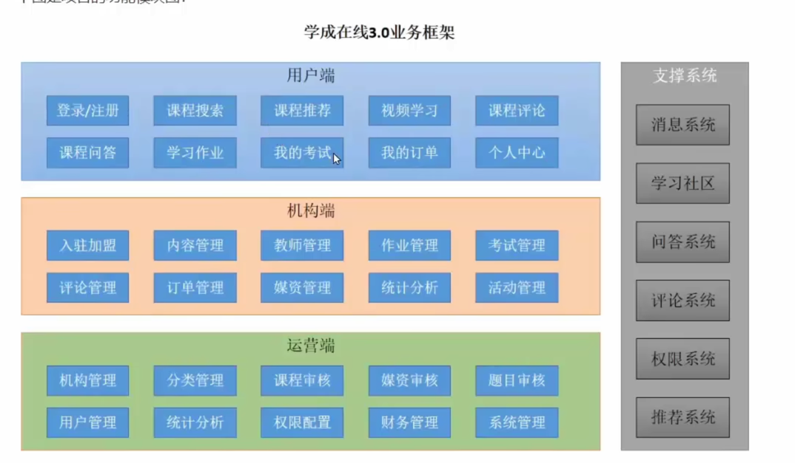
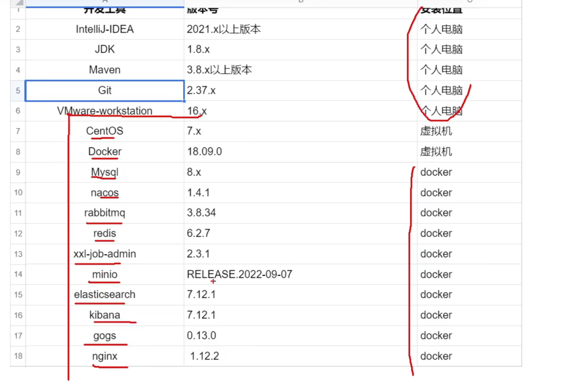

# 学成在线
B2B2C 企业对企业对客户（）business to customer

#### 面试
- 从下面几个方面进行项目介绍
  - 项目的背景，包括：是自研还是外包、什么业务、服务的客户群是谁、谁去运营
  - 项目的业务流程
  - 项目的功能模块
  - 项目的技术架构
  - 个人工作指责
  - 个人负责模块的详细说明，包括模块的是噩耗，所用到的技术，技术的实现方案等

#### 项目的技术架构

#### 配置环境
查看git在mac上的安装目录 which git

### 一些遇到的问题
- 使用mac上的vmware fusion进行安装centos 7的时候会卡在安装界面 需要用特殊的ISO文件
- 在docker里面启动mysql会无法启动 需要拉mysql/mysql-server的镜像而不是mysql的镜像