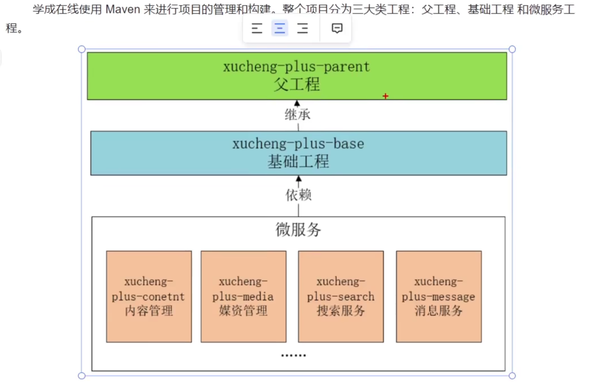

# 学成在线
B2B2C 企业对企业对客户（）business to customer

#### 面试
- 从下面几个方面进行项目介绍
  - 项目的背景，包括：是自研还是外包、什么业务、服务的客户群是谁、谁去运营
  - 项目的业务流程
  - 项目的功能模块
  - 项目的技术架构
  - 个人工作指责
  - 个人负责模块的详细说明，包括模块的是噩耗，所用到的技术，技术的实现方案等

#### 项目的技术架构

#### 配置环境
- 查看git在mac上的安装目录 which git

- 让服务一直运行：
docker run -p 3306:3306 --name JY_mysql -e MYSQL_ROOT_PASSWORD=123456 -d mysql
（参数 -p 设置端口，--name 取名 ，-e代表设置环境变量 MYSQL_ROOT_PASSWORD=123456 设置 账号为 root ，密码为 123456 ，-d 表示作为一个守护进程在后台运行 ）
- docker exec -it mysql /bin/bash 进入mysql
  (参数 -i -t 等价于 -it  表示insert , 进入 ;  /bin/bash 表示 shell 脚本交互界面 )

  
#### 基础工程搭建
- 工程结构关系

- 父工程：确定所有依赖版本 模块聚合
  - 配置pom文件 确定依赖版本；加<dependencyManagement>的标签
- 基础工程： 基础代码 在定义base module的时候要写relativePath,基于当前pom找到父工程
  > <relativePath>../xuecheng-plus-parent</relativePath>
- 

### 一些遇到的问题
- 使用mac上的vmware fusion进行安装centos 7的时候会卡在安装界面 需要用特殊的ISO文件
- 在docker里面启动mysql会无法启动 需要拉mysql/mysql-server的镜像而不是mysql的镜像

