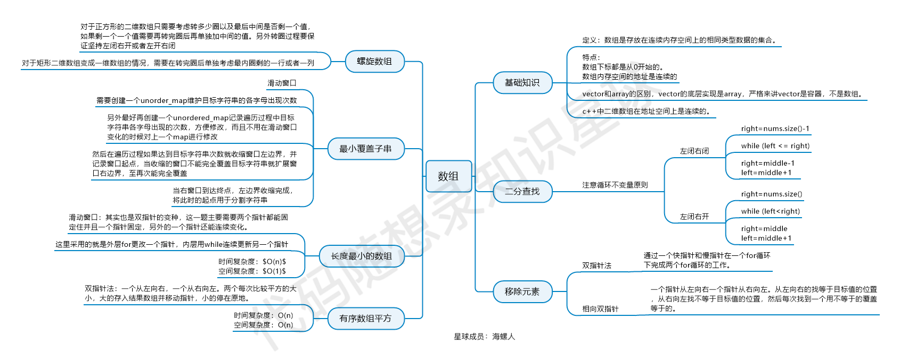

### 数组
#### 二分查找数组
一开始一定要定义好区间的定义
一般是[left,right]或者[left,righ) 我更喜欢前者

以[left,right]为例子：
- while(left<=right)要使用<=因为left==right是有意义的
- if(nums[mid]>target) right要赋值为mid-1因为当前这个nums[mid]一定不是target

#### 原地移除指定元素
快慢指针
- 快指针遍历数组
- 慢指针指向新数组末尾
- 当快指针指向数组末尾时 返回慢指针

#### 长度最小的子数组
- 滑动窗口（双指针）

总结：

