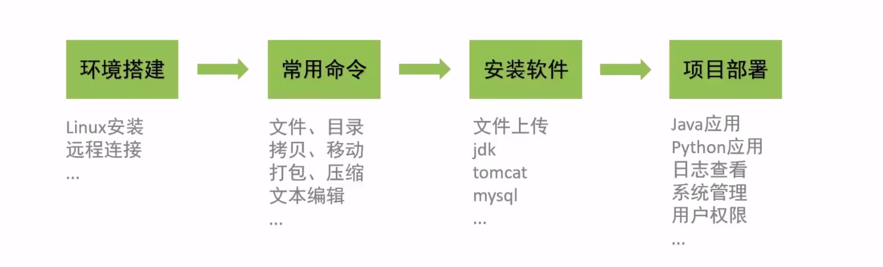
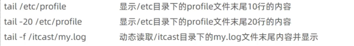
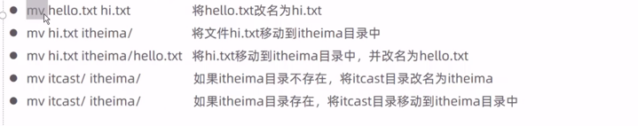
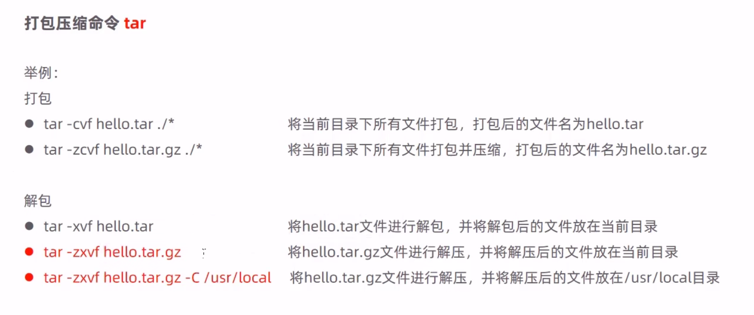
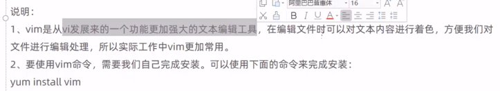
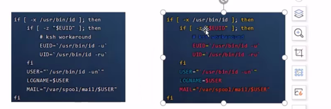

Linux是一套免费使用和自由传播的操作系统

- 特点：免费 开源 多用户 多任务

#### 常用命令

 
一些便捷技巧：
- Tab键自动补全
- 连续两次Tab键，给出操作提示
- 使用ctrl+l或者clear实现清屏

 Linux指令格式
 command [-options] [parameters]
- command 命令名
- [-options] 选项，可用来对命令进行控制，也可以省略
- [parameters] 传给命令的参数，可以是0个、1个或多个
> 注意：
> []代表可选
> 命令名、选项、参数之间有空格进行分隔

##### 文件操作目录
文件操作目录：

**语法:ls[-al][dir]**
- -a显示所有文件以及目录
- -l除文件名称外，同时将文件型态(d表示目录，-表示文件)、权限、拥有者、文件大小等信息详细列出
ls -l在linux简写为ll

**语法：cd[dirName]**
特殊说明：
- ～表示用户所在的home目录
- .表示目前所在的目录
- ..表示目前所在目录的上级目录

**语法：cat[-n] fileName**
说明：
- -n：由1开始对所有输出的行数编号

**语法：more fileName**
 操作说明：
- 回车键：向下滚动一行
- 空格键：向下滚动一屏
- b：返回上一屏
- q或者Ctrl+C 推出more

如： more /etc/profile

**语法：tail [-f] fileName**
查看文件末尾的内容

- -f动态读取文件末尾内容并显示，常用于日志文件的内容输出

**语法:mkdir [-p] dirName**
- *-p确保目录名称存在，不存在的就创建一个。通过此选项可以实现多层目录同时创建*

**rmdir [-p] dirName**
作用：删除空目录 **注意必须是空目录**
- -p当子目录被删除后使得父目录为空目录的话，则一并删除

**rm [-rf] name**
作用：删除文件或目录

- -r：将目录以及目录中的所有文件（目录）逐一删除，即递归删除
- -f：无需确认，直接删除

#### 拷贝移动命令

**语法：cp [-r] source dest**
作用：用于复制文件或目录
- -r如果复制的是目录需要使用此选项，此时将复制该目录下所有的子目录和文件

> cp -r source/ dest/
> 该命令是Linux或Unix系统中的一个文件操作命令，用于将 source 目录下的所有文件和子目录复制到 dest 目录中。
> 
> 解释：
    cp：是复制命令的名称。
-r：是 cp 命令的一个选项，表示进行递归复制，即复制目录及其所有子目录和文件。
source/：表示源目录，即要复制的目录。注意，目录名后面的斜杠 / 是用来指示复制目录下的所有内容。
dest/：表示目标目录，即文件和子目录将会被复制到的目标位置。
总之，该命令的含义是将 ithe 目录下的所有内容（包括文件和子目录）复制到 ithesx 目录中。
如果后面不加/则只复制这个目录而不包括它的子目录
 

**语法：mv source dest**
为文件或目录改名、或将文件或目录移动到其他位置

#### 打包压缩命令tar
作用：对文件进行打包、解包、压缩、解压
**语法：tar[-zcxvf] fileName [files]**
- 包文件后缀.tar表示只是进行了打包
- 包文件后缀.tar.gz表示打包的同时还进行了压缩

#### 文本编辑工具 vi/vim
**语法：vi fileName**
vim会着色 vi不会

##### 查找命令 find
**语法：find dirName -option fileName**
- find . -name "*.java" 在当前目录以及其子目录下查找.java结尾的文件
- find /itcast -name "*.java" 在itcast目录及其子目录下查找.java结尾的文件

**语法：grep word fileName**
说明：在指定文件中查找指定的文本内容

grep Hello HelloWorld.java 查找HelloWorld.java文件中出现的hello字符串的位置
grep hell *.java 查找当前目录中所有.java结尾的文件中包含hello字符串的位置

**ps命令**
- ps是linux系统下非常强大的进程查看命令，通过ps -ef可以查看当前运行的所有进程的详细信息
- "｜"在linux中称为管道富符，可以将前一个命令的结果输出给后一个命令作为输入
- 使用ps命令查看进程时，经常配合管道符和查找命令grep一起使用，来查看特定进程

#### 防火墙相关命令
- **systemctl**是管理Linux中服务的命令，可以对服务进行启动、停止、重启、查看状态等操作
- firewall-cmd是Linux中专门用于控制防火墙的命令
- 为了保证系统安全，服务器的防火墙不建议关闭

- 查看防火墙状态：systemctl status firewalld /  firewall-cmd --state
- 暂时关闭防火墙 systemctl stop firewalld
- 永久关闭防火墙 systemctl disable firewalld
- 开启防火墙 systemctl start firewall
- 开放指定端口 firewall-cmd --zone=public --add-port=8080/tcp --permanent
- 关闭指定端口 firewall-cmd --zone=public --remove-port=8080/tcp --permanent
- 立即生效 firewall-cmd --reload
- 查看开放的端口 firewall-cmd --zone=public --list-ports

