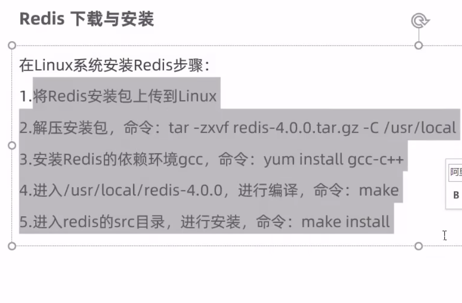
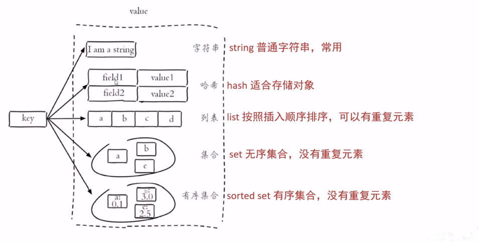
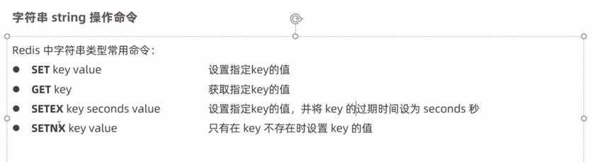
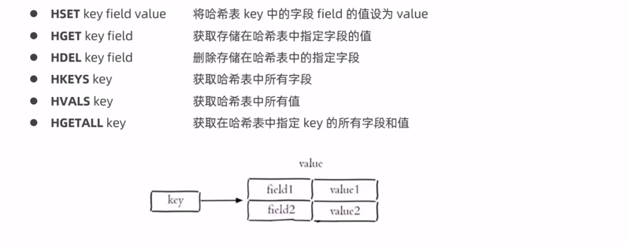
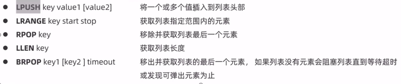
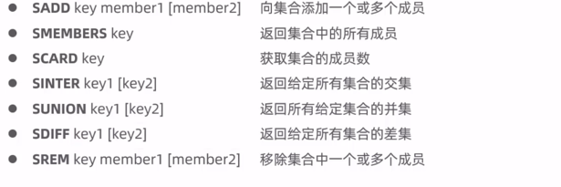
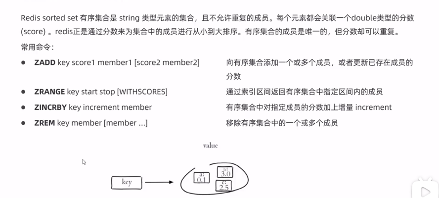
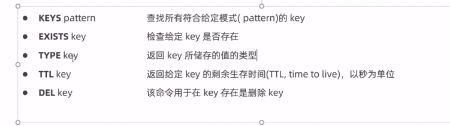

#### 什么是Redis
Redis是一个基于内存的key-value结构数据库，可以用作数据库、缓存和消息中间件
- 基于内存存储，读写性能高（mysql是基于磁盘
- 适合存储热点数据（热点商品、资讯、新闻）
- 企业应用广泛

存储的value类型比较丰富，也被称为结构化的NoSql数据库
NoSql(Not Only Sql) 泛指非关系型数据库。不是要取代关系型数据库，而是对关系型数据库的补充

#### Redis应用场景
- 缓存
- 任务队列
- 消息队列
- 分布式锁

#### Redis安装

- 启动Redis
  - 在src文件夹使用redis-server redis.conf启动

- 连接Reids
  - 在src文件夹使用redis-cli

在redis.conf 文件里有一项为：daemonize：no 表示默认不在后台运行 改为yes以后可以在后台运行
在redis.conf 文件里有一项为：requirepass 取消掉这一行的注释可以设置redis密码
在有密码的情况下，连接redis的指令

redis 默认是不能远程连接的
在conf里有一行是 bind ip 把这行注释掉就可以远程连接了

#### Redis数据类型
 
Redis存储的是key-value结构的数据，其中key是字符串类型，value有五种常用的类型
- 字符串String
- 哈希 hash
- 列表 list
- 集合 set
- 有序集合 sorted set
 

#### Redis常用命令
- String value命令

- hash value命令

- list value命令
Redis列表是简单的字符串列表，也就是说列表里面存的全是字符串

- lpop key value 移除并获取列表的第一个元素

- set value命令 set是string类型的无序集合

- sorted set value命令
- 是string类型元素的集合，且不允许重复的成员。每个元素都会关联一个double类型的分数（score）。***redis正是通过分数来为集合中的成员进行从小到大排序。有序集合的成员是唯一的，但是分数却可以重复。***
  

**通用命令**
 

#### 在Java中操作Redis
Redis的Java客户端很多，官方推荐的有三种：
- Jedis
- Lettuce
- Redisson
Spring对Redis客户端进行了整合，提供了Spring Data Redis，在Spring Boot项目中还提供了对应的Starter，即spring-boot-starter-data-redis