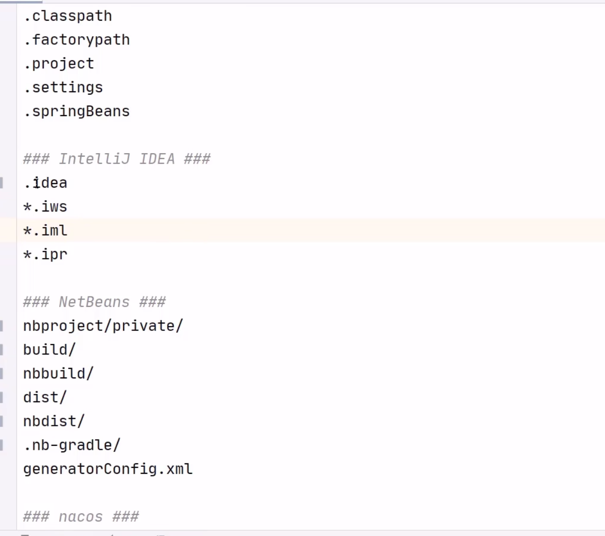

#### 基本概念
- 版本库：
    - .git隐藏文件夹就是版本库，版本库中存储了很多配置信息、日志信息和文件版本信息等
- 工作区：
    - 包含.git文件夹的目录就是工作区，也称为工作目录主要用于存放开发的代码
- 暂存区：
    - .git文件夹中有很多文件，其中一个index文件就是暂存区，也可以叫做stage。暂存区是一个临时保存修改文件的地方。
      
#### 常用命令
- git status 查看文件状态
- git add 将文件的修改加入暂存区
- git reset 将暂存区的文件取消暂存或者是切换到指定的版本
- git commit 将暂存区的文件修改提交到版本库
- git log 查看日志
- git push [remote] [branch]
- got pull

#### 分支操作
- git branch 列出所有本地分支
  - git branch -r 列出远程分支
  - git branch -a 列出所有远程和本地分支
- git branch [name] 创建分支
- git checkout [name] 切换分支
- git push [shortname][name] 推送至远程仓库分支
- git merge [name] 合并分支
> checkout to master
> git merge b1代表把b1合并到master分支

#### 标签操作  类似于快照
- git tag 列出已有的标签
- git tag[name] 创建标签
- git push [shortName][name]
- git checkout -b [branch] [name] 检出标签 在这一步会创建一个新的分支 所以branch是指定新的分支的分支名字

.gitignore文件描述了git可以忽略的文件 不需要提交

- .iml是idea特有的文件不需要提交
- tartget目录也不需要提交
- .idea是idea运行的一些东西也不需要提交...
