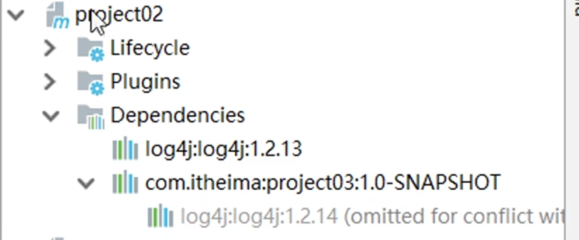
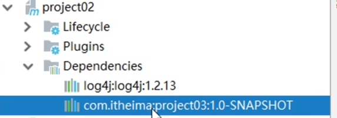
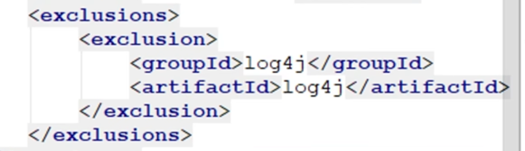
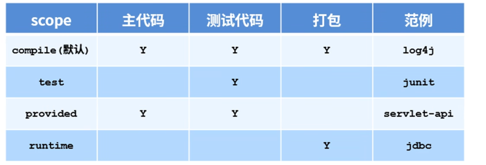
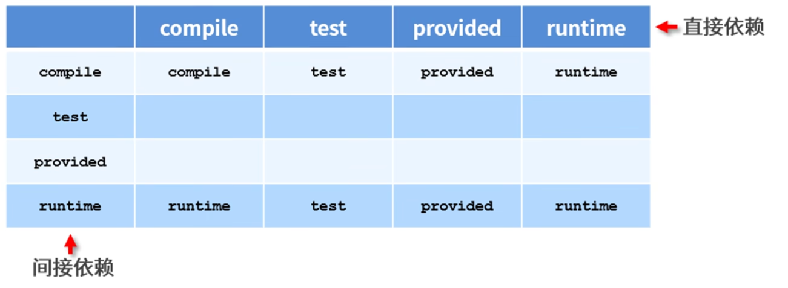
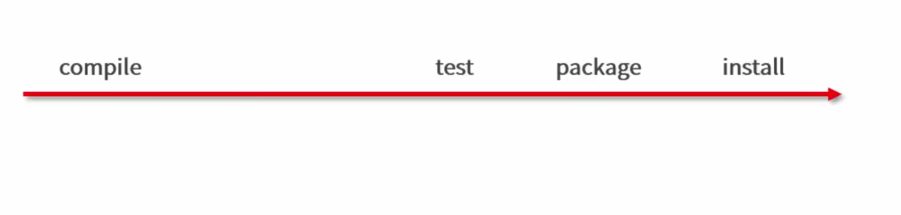

##### 传统项目管理状态分析
- jar包不统一，jar包不兼容

##### Maven是什么
- Maven的本质是一个项目管理工具，将项目开发和管理过程抽象成一个项目对象模型（POM）
- POM（Project Object Model）:项目对象模型

##### Maven的作用
- 项目构建：提供标准的、跨平台的自动化项目构建方式
- 依赖管理：方便快捷的管理项目依赖的资源（jar包），避免资源间的版本冲突问题
- 统一开发结构：提供标准的，统一的项目结构

#### Maven基础概念
##### 仓库
- 仓库：用于存储资源，包含各种jar包
- 仓库分类：
  - 本地仓库：自己电脑上的仓库，连接远程仓库获取资源
  - 远程仓库：
    - 中央仓库：Maven团队维护，存储所有资源的仓库
    - 私服：部门/公司范围内存储资源的仓库，从中央仓库获取资源
  - 私服的作用：
    - 保存具有版权的资源，包含购买或自主研发的jar
      - 中央仓库的jar都是开源的，不能存储具有版权的资源
    - 一定范围内共享资源，仅对内部开放，不对外共享、
##### 坐标
##### 仓库配置

## 遇到的一些问题
- maven的版本必须比idea的版本低 否则在idea中建立项目时会出现问题

#### 依赖传递冲突问题
- 路径优先：当依赖中出现相同的资源时，层级越深，优先级越低，层级越浅，优先级越高
- 声明优先：当自资源在相同层级被依赖时，配置顺序靠前的覆盖配置顺序靠后的
- 特殊优先：当同级配置了相同资源的不同版本，后配置的覆盖先配置的
#### 可选依赖 
<optional>true</optional>
这样别人就看不到你使用了是什么配置
 

#### 排除依赖

#### 依赖管理
- 依赖的jar默认情况下可以在任何地方使用，可以使用scope标签设定其作用范围
- 作用范围
  - 主程序范围有效（main文件夹范围内）
  - 测试程序范围有效（test文件夹范围内）
  - 是否参与打包（package指令范围内）

#### 依赖范围的传递性
- 带有依赖范围的资源在进行传递时，作用的范围将受到影响

#### 生命周期与插件
- 项目构建生命周期

